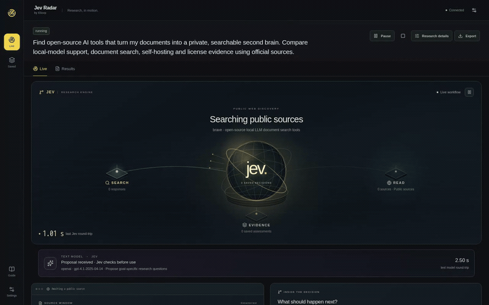
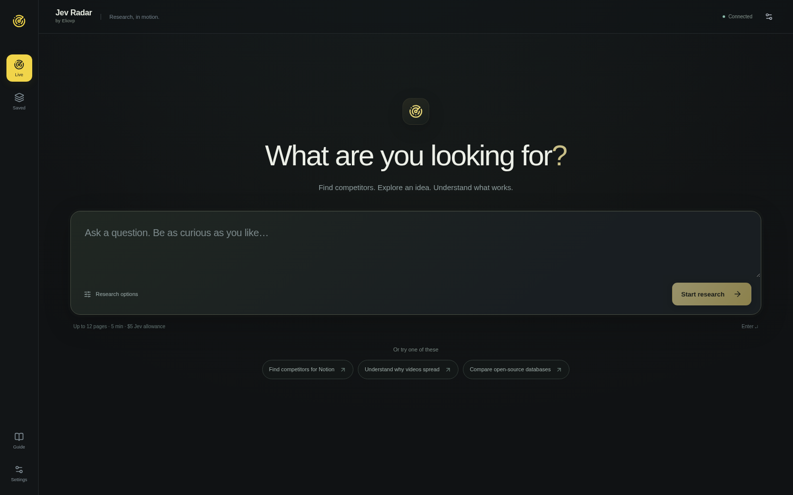
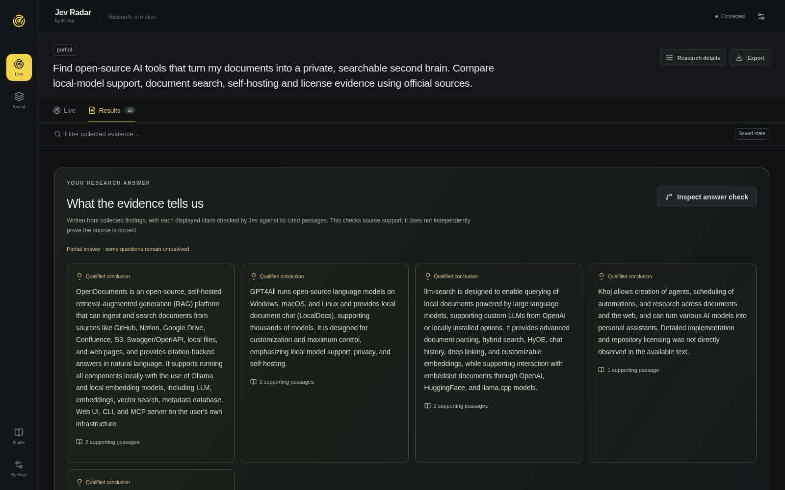

<div align="center">

# Jev Radar by Eliovp

**Ask a question. Watch Jev investigate. Follow the evidence.**

A local research workspace powered by Jev's structured decisions, public sources, and your choice of text model.

[Get started](#get-started) · [See the demo](#a-real-investigation) · [Setup guide](docs/SETUP.md) · [How it works](docs/ARCHITECTURE.md) · [Contribute](CONTRIBUTING.md)



[Watch the MP4 recording](docs/media/radar-demo.mp4) · [Full-size live screenshot](docs/media/radar-live.png)

</div>

## Start with a question

- “Find competitors for my product and compare their public capabilities, pricing and positioning.”
- “Which open-source tools could become my private AI second brain?”
- “Find original videos about a topic and compare the evidence for what gained traction.”
- “Investigate this technical claim. Find supporting evidence, counterexamples and what is still unknown.”

Radar discovers sources, inspects their content, asks the same research questions across records, and builds an evidence-linked comparison. You can inspect every saved Jev decision, open its supporting passages, filter results, replay the investigation, and export your findings.

## What Jev does here

| Part | Responsibility |
| --- | --- |
| **Jev** | Selects a research method, accepts or declines proposed questions and searches, chooses which observed leads to inspect, assesses collected evidence, and checks answer claims. |
| **Search and browser tools** | Find public URLs and collect permitted page content. Independent selected leads can be inspected concurrently. |
| **Optional text model** | Proposes goal-specific questions and searches, then drafts an answer from saved findings for Jev to check. |
| **Radar** | Enforces budgets and acquisition rules, preserves source links and unknowns, and shows actual activity, request timings and estimated spend. |

The live scene follows recorded requests and decisions. Multiple requests appear together when they are actually in flight. Saved replay makes no new provider calls. A comparison matrix shows how each inspected record answers your questions, including missing evidence.

Jev is hosted by TypeSafe. Radar itself runs on a normal **CPU machine**, with no GPU frameworks or local model weights. Jev does not supply a search index; automatic discovery uses Brave Search.

## Get started

**Requirements:** Python 3.11+, Node.js 22.12+ (or Node 20.19+ within Node 20), npm and Git. Use Linux, macOS or WSL.

```bash
git clone https://github.com/Eliovp-BV/Jev-Radar.git
cd Jev-Radar
./scripts/install.sh
```

The installer creates `.env` from the blank template if it is missing. **Open that file locally and add your keys:**

| Key in `.env` | Purpose |
| --- | --- |
| `TYPESAFE_API_KEY` | Required for Jev's decisions and evidence assessment. |
| `BRAVE_SEARCH_API_KEY` | Required for automatic discovery from a prompt. |
| `OPENAI_API_KEY`, `GEMINI_API_KEY`, `ANTHROPIC_API_KEY` or `OPENROUTER_API_KEY` | Optional: add only your chosen text provider's key. |

Keys stay on the server. They are never entered in the browser or included in source control. An OpenAI-compatible provider is also supported; see the [configuration guide](docs/SETUP.md#add-server-side-keys).

```bash
./scripts/run.sh
```

Open **http://127.0.0.1:8787**, or use this machine's LAN IP from another device. The default bind address is `0.0.0.0`; the launcher prints the actual port.

**Trusted networks only:** there is no login, so anyone who can reach the app can read research and start paid requests. Set `RADAR_HOST=127.0.0.1` for local-only access. [Security details](docs/SECURITY.md).

1. In **Settings → API connections**, reload keys. If using a text model, select its provider and model, check its price estimates, and save.
2. Return to **Live → What are you looking for?** Enter a goal and press **Start research**.
3. Watch the investigation, then open **Results** for findings, comparisons, source passages and remaining unknowns.

**Settings → Spend limits** defaults to **$5 for Jev and $20 for the text model per investigation**. These are estimated ceilings, not typical costs or provider billing caps. Search charges are separate; page, request, token and time limits also apply.

Chromium is optional for JavaScript page rendering:

```bash
./scripts/install.sh --with-browser
```

For provider setup, model options, network access and troubleshooting, see [Setup](docs/SETUP.md). The app also includes a searchable **Guide**.

## A real investigation

The included media comes from a new public research run:

> Find open-source AI tools that turn my documents into a private, searchable second brain. Compare local-model support, document search, self-hosting and license evidence using official sources.

The recording shows the actual interface at normal speed. It uses real Brave discovery, hosted Jev decisions and a configured text model. No results, decisions or timings were scripted. Read the [demo notes](docs/DEMO.md) for its scope, measured results and limitations. The demo database is not included: your installation starts empty.

<details>
<summary>See the starting screen and research results</summary>





</details>

## Built for inspectable research

- **Goal-specific research:** product landscapes, technical artifacts, content, individual videos and open questions.
- **Evidence you can follow:** saved source excerpts, collection coverage, Jev decisions, uncertainty and review states.
- **Collection comparisons:** common questions across records, filters, supported and unknown cells, and measured assessment timings.
- **A visible workflow:** live spatial visualization, concurrent activity, pause/resume controls and recorded replay.
- **Your research stays organized:** local SQLite persistence, saved investigations, reruns, imports and retention controls.
- **Portable results:** Markdown, HTML, CSV, structured JSON and a research-matrix CSV.

Research is bounded. Search appearance is not popularity; a supported passage is not independent proof; inaccessible content remains unknown. Video research assesses the text and metadata actually collected—it does not watch video or infer unseen footage. A run may finish with partial coverage. See [current limitations](docs/LIMITATIONS.md).

## Documentation and contributing

| Read | For |
| --- | --- |
| [Setup](docs/SETUP.md) | Installation, keys, providers, settings and troubleshooting |
| [Architecture](docs/ARCHITECTURE.md) | Research loop, Jev integration and modules |
| [Data provenance](docs/DATA_PROVENANCE.md) | Evidence, imports, metrics and export semantics |
| [Development](docs/DEVELOPMENT.md) | Tests, UI checks and opt-in live checks |
| [Contributing](CONTRIBUTING.md) | Changes and clean public-source releases |
| [Security](docs/SECURITY.md) | Network boundaries and data handling |
| [Limitations](docs/LIMITATIONS.md) | What the application can and cannot establish |

```bash
# After installing with --with-browser:
./scripts/test.sh
```

Normal tests use isolated fixtures and block unmocked model calls. Paid live checks are separate and opt-in. Keep `.env`, databases, imports, exports, browser profiles and local notes out of commits. Public demo media is explicitly reviewed and allowlisted by the source exporter.

## License

[MIT](LICENSE) · Copyright © 2026 Eliovp BV. Dependency and service acknowledgements are in [Third-party notices](docs/THIRD_PARTY_NOTICES.md).
